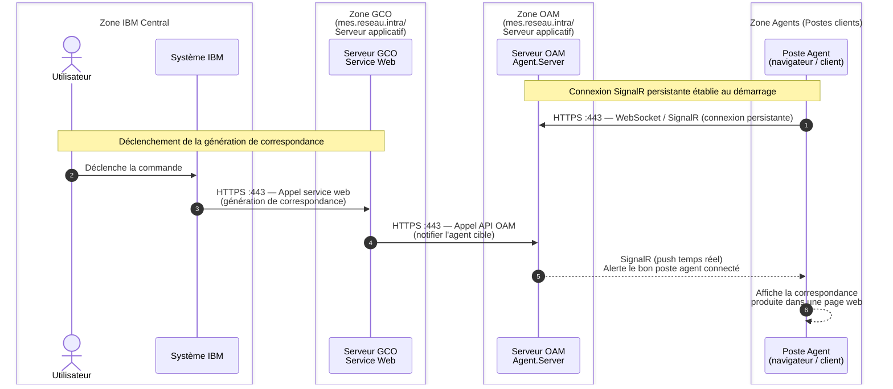
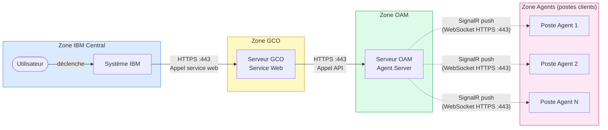

# Flux réseau - Génération de correspondance OAM

## Diagramme de séquence

---

## Diagramme de flux (zones et sens)

---

## Description des flux

| # | Source | Destination | Protocole | Port | Description |
|---|--------|-------------|-----------|------|-------------|
| 1 | Poste Agent | Serveur OAM | HTTPS / WebSocket | 443 | Connexion SignalR persistante (établie au démarrage de l'agent) |
| 2 | Système IBM | Serveur GCO | HTTPS | 443 | Déclenchement de la génération de correspondance |
| 3 | Serveur GCO | Serveur OAM | HTTPS | 443 | Appel API vers Agent.Server pour notifier l'agent cible |
| 4 | Serveur OAM | Poste Agent | SignalR (WebSocket) | 443 | Push temps réel vers le bon poste agent connecté |

> Tous les échanges en production transitent sur **HTTPS port 443**.
> Le flux SignalR (flèche pointillée) est un **push serveur vers client** sur la connexion WebSocket préalablement établie.
