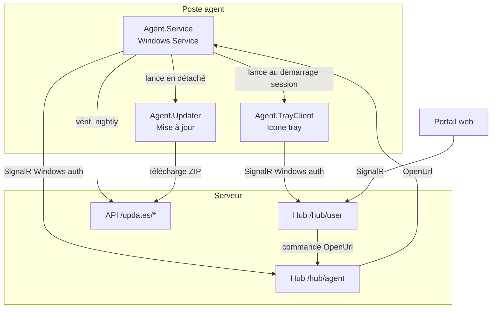

# OAM — Outil d'Aide à la Mission

OAM est un système d'agent Windows déployé sur les postes des agents de terrain. Il permet à un serveur central d'envoyer des commandes en temps réel aux postes (ex. : ouvrir une URL dans le navigateur) via SignalR, sans intervention manuelle de l'utilisateur.

## Architecture



## Composants

| Projet | Type | Rôle |
|---|---|---|
| **Agent.Service** | Windows Service | Tourne en arrière-plan sur le poste, maintient la connexion SignalR vers le serveur, exécute les commandes reçues (ex. ouvrir une URL) |
| **Agent.TrayClient** | WinForms (tray) | Icône dans la barre des tâches — indique visuellement l'état de connexion. Lance au démarrage de session utilisateur via le service |
| **Agent.Server** | ASP.NET Core | Serveur central — gère les hubs SignalR et expose l'API de mise à jour |
| **Agent.Updater** | Console | Exécutable autonome lancé par le service pour appliquer une mise à jour (remplace les fichiers, redémarre le service) |

## Mise à jour automatique

Le service vérifie une fois au démarrage puis chaque nuit (entre 1h et 6h, heure aléatoire pour étaler la charge) si une nouvelle version est disponible sur le serveur.

1. `GET /updates/check` — retourne le hash SHA-256 du ZIP disponible
2. Si le hash diffère du ZIP local, téléchargement et vérification d'intégrité
3. `Agent.Updater.exe` est copié dans `%TEMP%\OAM-updater\` puis lancé en processus détaché
4. L'updater arrête le service, remplace les fichiers, met à jour le DisplayName/Description Windows si nécessaire, redémarre

## Mode Test (dev / QA)

Le `Agent.TrayClient` peut être compilé en configuration **Test** (`--configuration Test`) pour les agents de QA ou les développeurs qui travaillent sur un environnement séparé.

- Icône rouge (distincte de la prod)
- Nom de l'environnement et utilisateur affichés dans le menu
- Option "Quitter" disponible
- Vérification de version au démarrage — bloque l'utilisation si le build n'est plus à jour
- Distribué via `GET /updates/test/download` : génère un ZIP à la volée avec l'exe et l'`appsettings.json` pré-configuré pour l'environnement

## Structure du dépôt

```
src/
  Agent.Service/       Windows Service (.NET Worker)
  Agent.TrayClient/    Tray app WinForms
  Agent.Server/        ASP.NET Core (Minimal API + SignalR)
  Agent.Updater/       Outil de mise à jour (single-file exe)
Documentation/         Docs techniques (sécurité, déploiement, réseau)
Manage-AgentService.ps1  Script PowerShell de gestion locale (build, install, update)
```

## Démarrage rapide (local)

```powershell
# Build + installation + démarrage du service Windows
.\Manage-AgentService.ps1 -Action install

# Créer un package de mise à jour (agent.zip)
.\Manage-AgentService.ps1 -Action make-update

# Créer un build Test pour QA
.\Manage-AgentService.ps1 -Action make-test
```

> Requiert PowerShell en mode administrateur.
