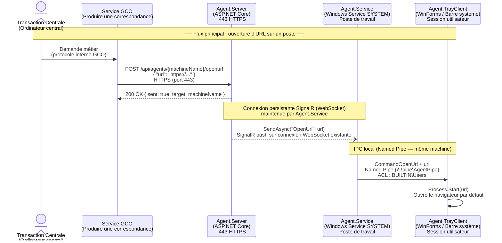
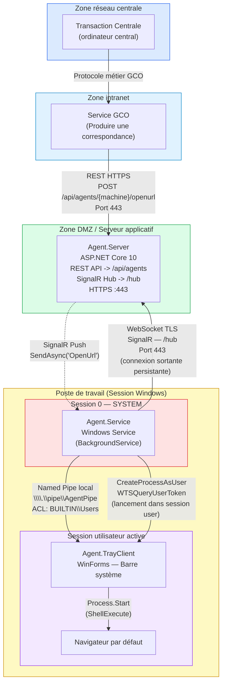

# Flux réseau — Agent.Service

## Diagramme de séquence (flux principal)

---

## Diagramme d'architecture réseau

---

## Points d'attention sécurité

| # | Élément | Observation | Risque |
|---|---------|-------------|--------|
| 1 | **REST API sans authentification** | `AgentsController` n'a aucun `[Authorize]` | Tout appelant réseau peut déclencher un `OpenUrl` sur n'importe quel poste |
| 2 | **HTTP exposé** | Port `80` non chiffré potentiellement accessible | Interception possible si pas de firewall — seul le port `443` HTTPS devrait être exposé |
| 3 | **URL non validée** | Le champ `url` reçu en JSON est transmis directement à `Process.Start(ShellExecute)` | SSRF / exécution de protocoles arbitraires (ex. `file://`, `ms-excel://`) |
| 4 | **Named Pipe ACL** | Accessible à `BUILTIN\Users` (tout utilisateur local) | Un autre processus utilisateur peut injecter des commandes dans le pipe |
| 5 | **AllowedHosts: `*`** | Pas de restriction d'hôte sur le serveur | Facilite les attaques de type host-header injection |
